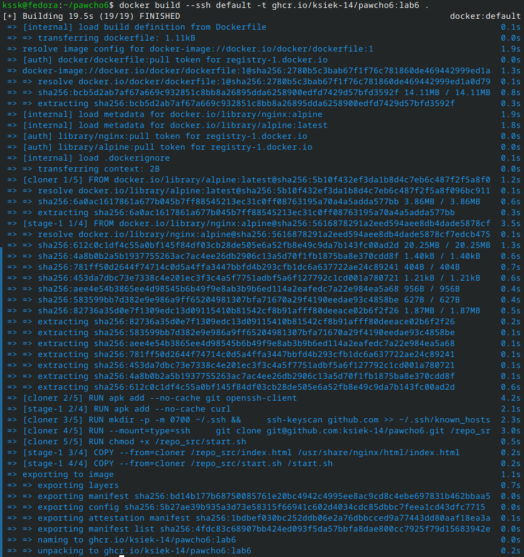
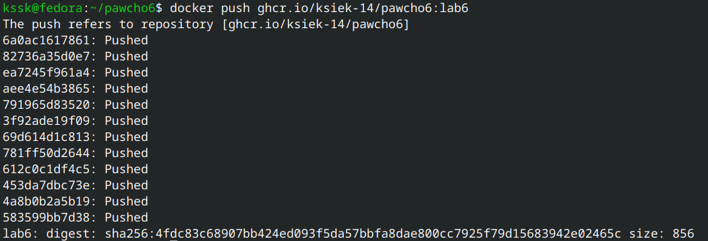
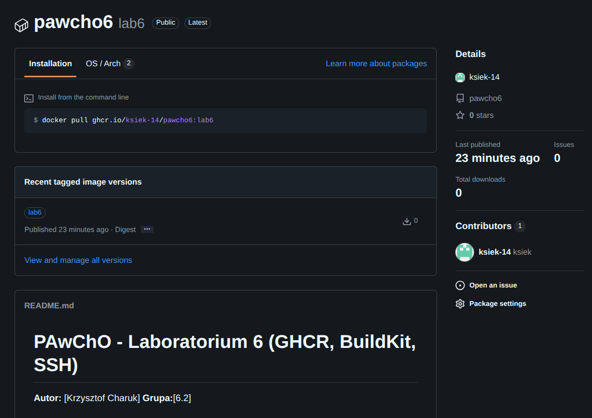

# PAwChO - Laboratorium 6 (GHCR, BuildKit, SSH)

**Autor:** [Krzysztof Charuk]
**Grupa:**[6.2]

---

## 1. Modyfikacja plików i logiki (Dockerfile)
Logikę aplikacji wyciągnąłem do osobnych plików (`index.html` oraz `start.sh`) w tym repozytorium. Zmodyfikowany `Dockerfile` wykorzystuje rozszerzony frontend silnika **BuildKit** (`# syntax=docker/dockerfile:1`), co pozwala na bezpieczne, bezpośrednie sklonowanie tego kodu przez protokół SSH. 

Zrezygnowałem z etapu bazującego na obrazach Ubuntu czy dogrywania rootfs-ów. Do klonowania użyłem bardzo lekkiego, dedykowanego obrazu `alpine` z zainstalowanym pakietem `git`, po czym pliki te przeniosłem do docelowego obrazu produkcyjnego `nginx`. 

Plik `Dockerfile` znajduje się bezpośrednio w repozytorium.

---

## 2. Budowa obrazu z przekazaniem klucza SSH
Aby kontener w czasie budowy mógł bezpiecznie sklonować repozytorium, uruchomiłem lokalnie proces `ssh-agent` i przekazałem go do wewnątrz kontenera parametrem `--ssh default`.

Użyte polecenie:
`docker build --ssh default -t ghcr.io/ksiek-14/pawcho6:lab6 .`

**Wynik procesu budowania:**

---

## 3. Publikacja w GitHub Container Registry (ghcr.io)
Zalogowałem się do rejestru przy użyciu wygenerowanego tokenu **PAT (classic)** z nadanymi uprawnieniami *write:packages*. Następnie wypchnąłem zbudowany obraz do przypisanego do mojego konta rejestru pakietów.

Użyte polecenie:
`docker push ghcr.io/ksiek-14/pawcho6:lab6`

**Wynik przesłania obrazu:**

---

## 4. Konfiguracja repozytorium i pakietu (Web)
Korzystając z graficznego interfejsu przeglądarkowego serwisu GitHub:
1. Zmieniłem widoczność wgranego pakietu obrazu z prywatnej na **publiczną** (atrybut Public).
2. Zintegrowałem wgrany obraz (Package) z niniejszym repozytorium kodowym używając opcji **Connect Repository**. 

Potwierdzenie prawidłowego wdrożenia:

